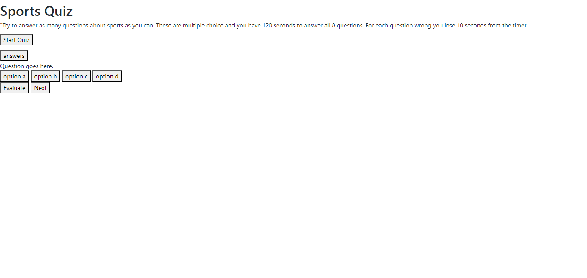

# sports-quiz-challenge

## Description 
I wanted to create this project to test my skills as a coder to create a quiz that would test a person's knowledge of sports. I wanted to highlight the ability to take a timed quiz with a timed penalty of 10 seconds for each wrong answer.

## Installation
N/A

## Usage 
To use the sports quiz you simply click on the start quiz button. The quiz will begin with the first question and you will have 120 seconds to answer all eight multiple choice questions. 

https://tgold1.github.io/sports-quiz-challenge/

